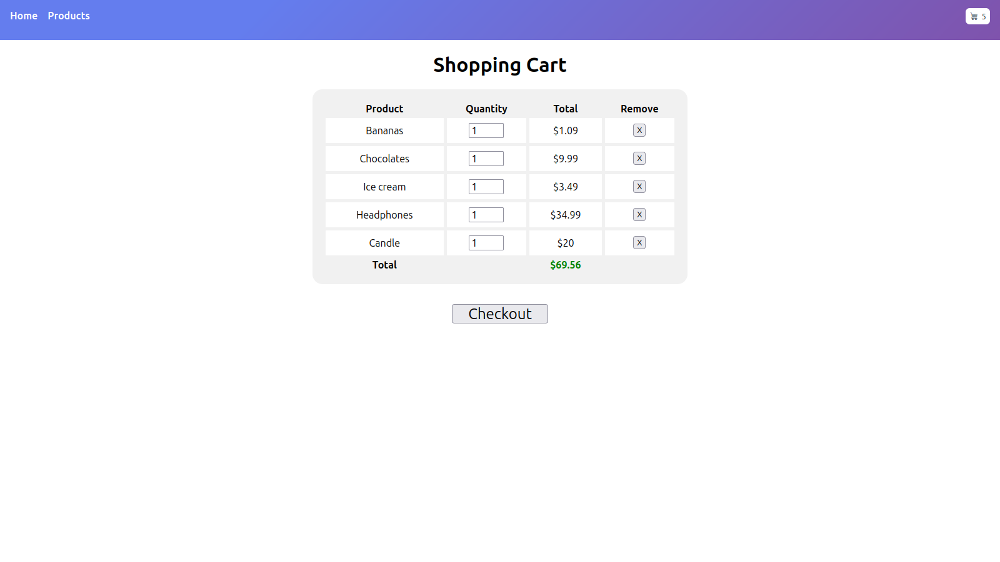

<a name="readme-top"></a>

<!--
HOW TO USE:
This is an example of how you may give instructions on setting up your project locally.

Modify this file to match your project and remove sections that don't apply.

REQUIRED SECTIONS:
- Table of Contents
- About the Project
  - Built With
  - Live Demo
- Getting Started
- Authors
- Future Features
- Contributing
- Show your support
- Acknowledgements
- License

After you're finished please remove all the comments and instructions!
-->

<div align="center">

  <br/>

  <h3><b>README Template</b></h3>

</div>

<!-- TABLE OF CONTENTS -->

# 📗 Table of Contents

- [📖 About the Project](#about-project)
  - [🛠 Built With](#built-with)
    - [Tech Stack](#tech-stack)
    - [Key Features](#key-features)
  - [🚀 Live Demo](#live-demo)
- [💻 Getting Started](#getting-started)
  - [Setup](#setup)
  - [Prerequisites](#prerequisites)
  - [Install](#install)
  - [Usage](#usage)
  - [Run tests](#run-tests)
  - [Deployment](#triangular_flag_on_post-deployment)
- [👥 Authors](#authors)
- [🔭 Future Features](#future-features)
- [🤝 Contributing](#contributing)
- [⭐️ Show your support](#support)
- [🙏 Acknowledgements](#acknowledgements)
- [❓ FAQ](#faq)
- [📝 License](#license)

<!-- PROJECT DESCRIPTION -->

# 📖 Redux Shopping Cart <a name="about-project"></a>

Redux Shopping Cart is a project that is built using React, Redux and TypeScript and it uses vite as a bundler. It is a simple shopping cart that allows users to add and remove items from the cart. It also allows users to increase and decrease the quantity of each item in the cart and updates the cart to nil on successful checkout. The project is built using React and Redux. It uses Redux to manage the state of the application. It uses React to render the UI. It uses Redux Thunk to handle asynchronous actions. It uses React Router to handle routing.

## 🛠 Built With <a name="built-with"></a>

### Tech Stack <a name="tech-stack"></a>

<details>
  <summary>Client</summary>
  <ul>
    <li><a href="">CRA</a></li>
  </ul></details>

<details>
  <summary>Server</summary>
  <ul>
    <li><a href="">N/A</a></li>
  </ul>
</details>

<details>
<summary>Database</summary>
  <ul>
    <li><a href="">N/A</a></li>
  </ul>
</details>

<!-- Features -->

### Key Features <a name="key-features"></a>

- **[Shopping Cart]**
- **[Add/Delete Items]**
- **[Update State]**
- **[Reject Empty]**

<p align="right">(<a href="#readme-top">back to top</a>)</p>

<!-- LIVE DEMO -->

## 🚀 Live Demo <a name="live-demo"></a>

- Coming Soon

<p align="right">(<a href="#readme-top">back to top</a>)</p>

<!-- GETTING STARTED -->

## 💻 Getting Started <a name="getting-started"></a>

### Prerequisites

In order to run this project you need:


```sh
 sudo apt install node
```

### Setup

Clone this repository to your desired folder:


```sh
  git clone git@github.com:OmarMWarraich/redux-shopping-cart-ts.git
```

### Install

Install this project with:


```sh
  cd redux-shopping-cart-ts
  npm i
```

### Usage

To run the project, execute the following command:

```sh
  npm run dev
```

### ScreenShot



### Run tests

To run tests, run the following command:

Coming Soon


### Deployment

Coming Soon

<p align="right">(<a href="#readme-top">back to top</a>)</p>

<!-- AUTHORS -->

## 👥 Author <a name="authors"></a>


👤 **OmarMWarraich**

- GitHub: [@OmarMWarraich](https://github.com/OmarMWarraich)
- Twitter: [@omarwarraich1](https://twitter.com/omarwarraich1)
- LinkedIn: [LinkedIn](https://linkedin.com/in/o-va)

<p align="right">(<a href="#readme-top">back to top</a>)</p>

## 🔭 Future Features <a name="future-features"></a>

> Describe 1 - 3 features you will add to the project.

- [ ] **[STRIPE INTEGRATION]**
- [ ] **[ADMIN PANEL]**
- [ ] **[BACKEND STORE]**
- [ ] **[Authentication & Login]**

<p align="right">(<a href="#readme-top">back to top</a>)</p>

<!-- CONTRIBUTING -->

## 🤝 Contributing <a name="contributing"></a>

Contributions, issues, and feature requests are welcome!

Feel free to check the [issues page](../../issues/).

<p align="right">(<a href="#readme-top">back to top</a>)</p>

<!-- SUPPORT -->

## ⭐️ Show your support <a name="support"></a>

If you like this project please give it a ⭐️!.

<p align="right">(<a href="#readme-top">back to top</a>)</p>

<!-- ACKNOWLEDGEMENTS -->

## 🙏 Acknowledgments <a name="acknowledgements"></a>

I would like to thank the following.
-  Egghead.io for their amazing tutorials.

<p align="right">(<a href="#readme-top">back to top</a>)</p>

<!-- FAQ (optional) -->

## ❓ FAQ <a name="faq"></a>

- **[How to use this app?]**

  - [Please check the usage section.]

<p align="right">(<a href="#readme-top">back to top</a>)</p>

<!-- LICENSE -->

## 📝 License <a name="license"></a>

This project is [MIT](./LICENSE) licensed.

<p align="right">(<a href="#readme-top">back to top</a>)</p>
